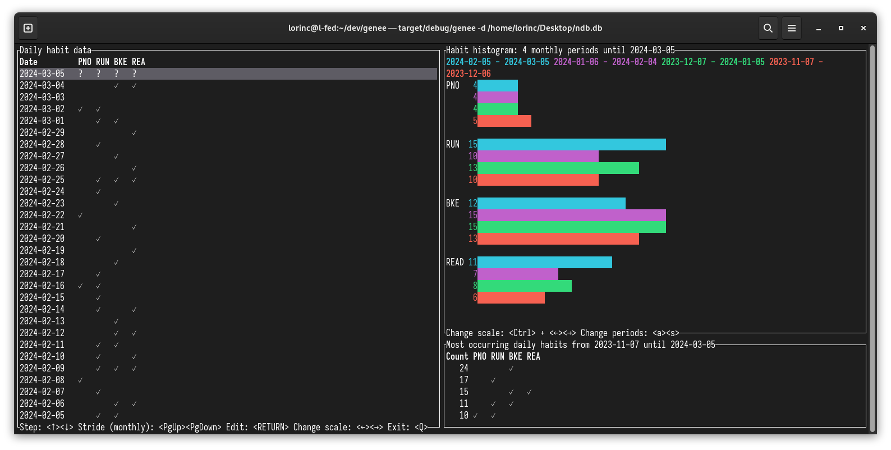

# genee

[](https://crates.io/crates/genee)
[](https://docs.rs/genee)
[](https://github.com/mfep/genee/actions)
[](https://deps.rs/repo/github/mfep/genee)

genee is a simple habit tracker program for the command line

## Features
- Daily tracking of habits 📅
- Open storage format: SQLite database 📄
- Pretty diagrams to compare successive periods of habit data 📊
- Store default settings persistently 💾

## Workflow

1. Figure out the list of habits to track. In this example, we would like to restrict
   our gaming binges and increase the frequency of our piano exercise sessions.
   `GAM` stands for gaming, whereas `PNO` stands for the instrumental practice.
2. Download the [latest release](https://github.com/mfep/genee/releases/latest) from this repository.
3. Using the downloaded executable, create a new data file to store the diary data.
   Specify the list of habit abbreviations to use in this file: `genee new GAM,PNO`
4. Each day, fill in whether you practiced the particular habits the previous day or not.
   Run `genee` which opens an interactive terminal interface. Habit data for each day can be
   added and edited, and various statistics are shown.

### Screenshot



## Full helptext

```
genee X.Y.Z
A habit tracker app with command-line interface

USAGE:
    genee [OPTIONS] [SUBCOMMAND]

FLAGS:
    -h, --help       Prints help information
    -V, --version    Prints version information

OPTIONS:
    -d, --datafile <datafile>
            Path to the diary file. When not provided, its value is loaded from persistent configuration file

    -f, --list-most-frequent-days <list-most-frequent-days>
            Specifies the number of most frequent daily habit compositions over the specified period

    -p, --past-periods <past-periods>
            Specifies the number of displayed periods when graphing the diary data. When not provided, its value is
            loaded from persistent configuration file

SUBCOMMANDS:
    add-category     Adds or unhides a category
    help             Prints this message or the help of the given subcommand(s)
    hide-category    Hides a category
    list-config      Prints the persistent configuration
    new              Provide a comma separated list of habit categories. A new diary file is created at the
                     specified --datafile path
    save-config      Saves the specified options to persistent configuration
```

## Building

genee builds with the standard Rust toolchain:

```
git clone https://github.com/mfep/genee.git
cd genee
cargo build --release
```

## Contribution

See [CONTRIBUTING.md](CONTRIBUTING.md).
